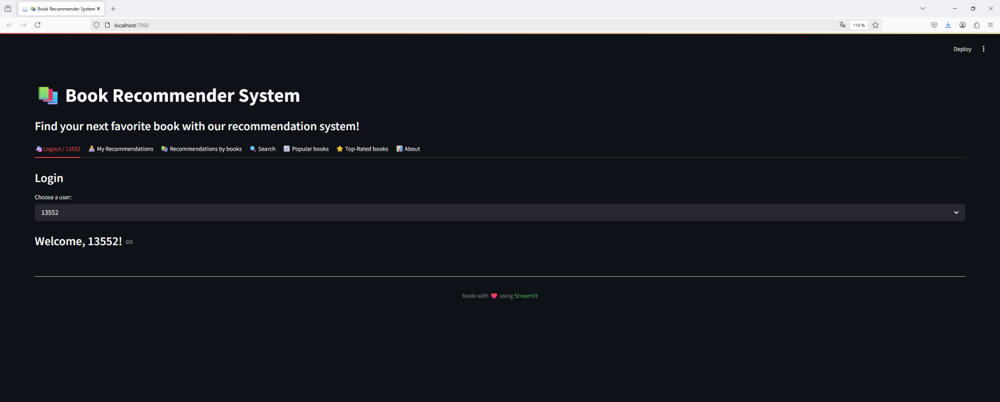
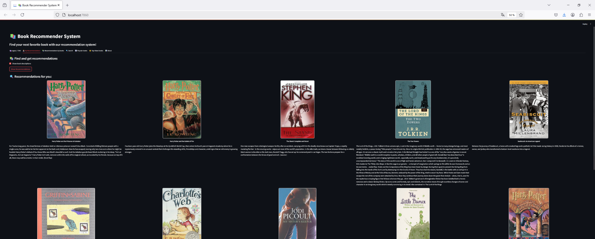
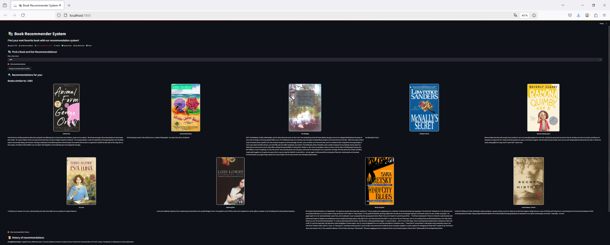
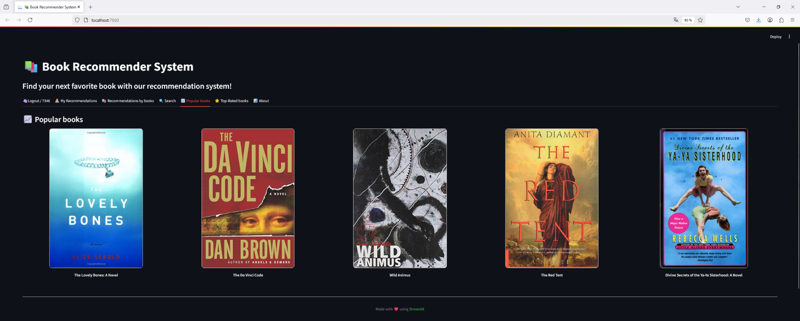
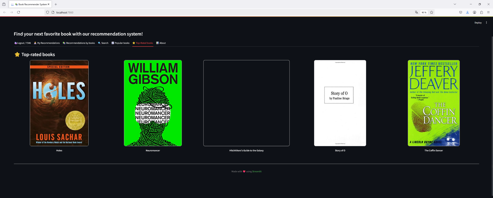

# 📚 Book Recommender System

Bienvenue sur notre projet de système de recommandation de livres !  
Ce projet a été développé dans le cadre d’un projet de certification en data science.

---

## 🎯 Objectif

Créer une application capable de recommander des livres à un utilisateur en fonction :
- De ses lectures passées (collaborative filtering)
- Ou de livres similaires (content-based filtering)
- Avec une interface simple et intuitive via Streamlit

---

## 🧠 Technologies utilisées

- **Python** (Pandas, NumPy, Scikit-Learn)
- **Streamlit** pour l’interface utilisateur
- **Pandas** pour la manipulation des données
- **Git/GitHub** pour le versionning
- **Jupyter Notebook / VS Code** pour le développement

---

## 📁 Structure du projet

```
├── notebook/                   # Notebooks d'analyse et de préparation
├── scripts/                    # Fonctions Python de recommandation
├── app/                        # Script Streamlit (app.py)
├── data/                       # Données de notation et de métadonnées
├── images/                     # Captures d'écran (voir plus bas)
└── README.md                   # Ce fichier
```

---

## 💡 Fonctionnalités principales

- 🔐 Connexion utilisateur (identifiant ou invité)
- 📚 Recommandations personnalisées basées sur l’historique
- 🔍 Recommandations à partir d’un livre donné
- 🌟 Section livres les plus populaires
- 🏆 Section livres les mieux notés
- 🔎 Recherche et affichage par titre
- 🖼️ Affichage des couvertures + descriptions (si disponibles)

---

## 📸 Aperçu du système de recommandation

### 🔐 Connexion utilisateur


### 📚 Recommandations personnalisées


### 🔍 Rechercher un livre similaire


### 🌟 Livres populaires


### 🏆 Livres les mieux notés


---

## 🚀 Lancer l’application

1. Cloner le repo :
```bash
git clone https://github.com/charlesdab/final_group_project_book_recommender.git
cd final_group_project_book_recommender
```

2. Installer les dépendances :
```bash
pip install -r requirements.txt
```

3. Lancer l’application Streamlit :
```bash
streamlit run app/app.py
```

---

## 👥 Auteurs

Projet réalisé en groupe dans le cadre de la formation Data Scientist – Jedha Bootcamp.  
Merci à tous les membres de l’équipe pour leur travail collaboratif.

---

## 📝 Améliorations possibles

- Ajouter un système de feedback utilisateur
- Filtrer par genre / auteur / langue
- Déployer l’application en ligne (ex: Streamlit Cloud)

---

## 🔗 Liens

- [Lien vers le projet GitHub](https://github.com/charlesdab/final_group_project_book_recommender)
